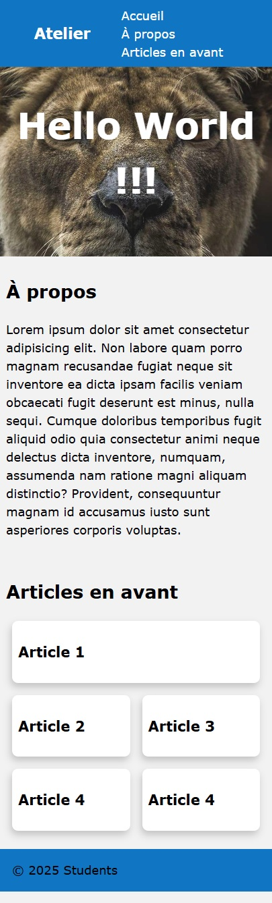
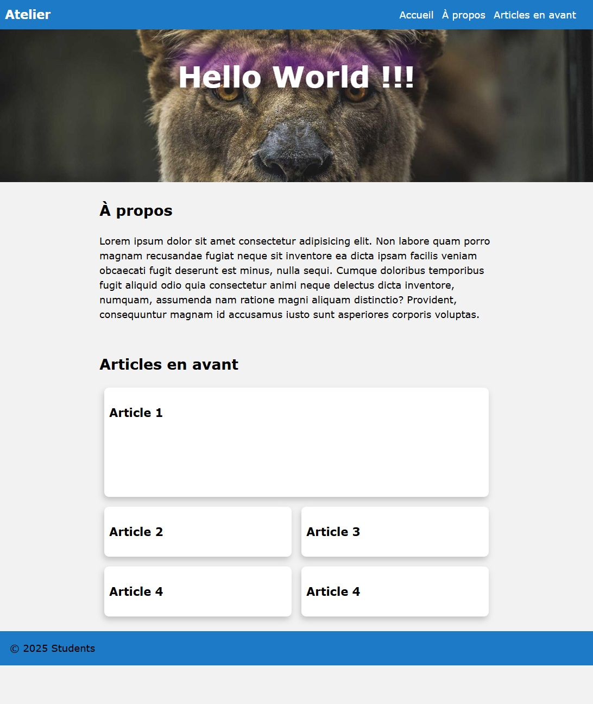

# Atelier Responsive Design

**Les objectifs de cet atelier** :  
• Améliorer l'intégration HTML avec les propriétés Flex et Grid.  
• Rendre l'ensemble Responsive.

## Initialisation

Cet atelier est la deuxième partie de l'[atelier de base HTML](https://github.com/PPaillard/atelier-html-css-basics).  
Vous pouvez donc partir de votre travail précédent ou [télécharger cette version](https://github.com/PPaillard/atelier-html-css-responsive/archive/refs/heads/main.zip) si vous n'êtes pas sûr de ce que vous avez fait.

## Mise en page de votre site web

Vous devrez créer un site web réactif de base en suivant la mise en page ci-dessous (**ne cherchez pas** à être pixel perfect, cette image est juste un guide).

<a href="./mobile_layout.jpg" target="_blank">Ouvrir dans un nouvel onglet <i class="bi bi-box-arrow-up-right"></i></a>  

_(La capture d'écran a été réalisée avec une largeur de fenêtre d'affichage de 360px, une taille standard de smartphone)._

### Barre de navigation

- Pour cette version mobile, la structure HTML de la barre de navigation n'a pas changé, mais sa présentation est différente. Reproduisez cela en utilisant **flexbox**.

Rappel :  
[Vidéo - Flexbox en 100s](https://www.youtube.com/watch?v=K74l26pE4YA)  
[Cheatsheet des bases de Flexbox](https://jonitrythall.com/content/images/flexboxsheet.pdf)

### En-tête

- La section `<header>` pourrait également être améliorée en utilisant **flexbox** pour centrer l'élément `<h1>` à la fois horizontalement et verticalement.

### Section Articles mis en avant

Contrairement à la section `À propos de nous`, qui n'a pas besoin d'être modifiée, la section `Articles en avant` nécessite l'ajout d'une division pour encadrer les articles ainsi que d'une classe CSS sur cette division

- Ajoutez une division qui entoure vos articles.
- Ajoutez la classe CSS `grille` à cette division.
- Ajoutez un cinquième article dans la structure HTML.
- Utilisez CSS Grid pour créer une mise en page à 2 colonnes. Selon le modèle, le premier article occupera 2 cellules de la grille, les autres seulement une.

> Rappel : [Les bases de CSS Grid en 5 minutes](https://www.freecodecamp.org/news/learn-css-grid-in-5-minutes-f582e87b1228).

> Astuce : Le premier article peut être ciblé avec le sélecteur CSS `:first-of-type`.

## Rendre le site Responsive

Ajoutez des media queries et utilisez des fonctions CSS pour obtenir la mise en page réactive ci-dessous à 1200px.

> Vous pouvez utiliser un breakpoint à 768px dans vos media queries (ce qui correspond au mode paysage de certaines tablettes).

<a href="./desktop_layout.jpg" target="_blank">Ouvrir dans un nouvel onglet <i class="bi bi-box-arrow-up-right"></i></a>  

_(La capture d'écran a été réalisée avec une largeur de fenêtre d'affichage de 970px.)_

- Rendez la barre de navigation réactive.
- Modifiez le modèle de la grille pour adapter les produits horizontalement sur une mise en page à 4 colonnes, tout en conservant un "Article 1" plus grand occupant 2 colonnes et 2 lignes.
- Ajoutez une propriété `filter: drop-shadow` sur le `<h1>` de l'élément `<header>`, mais uniquement pour les écrans afin d'exclure cet effet lors de l'impression.
- Bonus - Utilisez la fonction `clamp()` pour rendre votre `<h1>` lisible à toutes les tailles.
